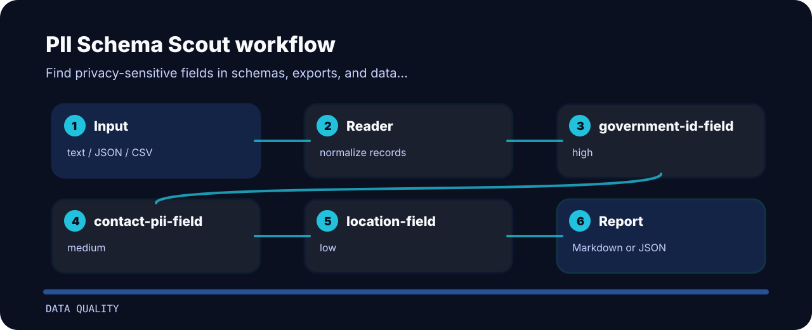

# PII Schema Scout


Find privacy-sensitive fields in schemas, exports, and data dictionaries. It keeps the review small: one input file, a short list of findings, and enough context to fix the line that caused the warning.

## Repo landmarks

```text
.github/        CI workflow
examples/       sample inputs
src/            package source
tests/          test coverage
```

## Decision points

| Signal | Level | What it flags | Fix direction |
| --- | --- | --- | --- |
| `government-id-field` | high | government identifier field detected | Require privacy review, masking, and access controls. |
| `contact-pii-field` | medium | direct contact or identity field detected | Confirm purpose, retention, and minimization requirements. |
| `location-field` | low | location-like field detected | Check whether location precision is necessary. |

## Inspection line



## Command path

```bash
git clone https://github.com/mertefekurt/pii-schema-scout.git
cd pii-schema-scout
python -m pip install -e ".[dev]"
pii-schema-scout examples/sample.txt
```
