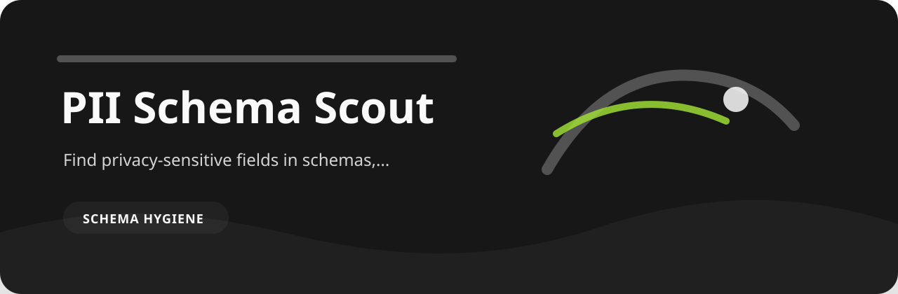

# PII Schema Scout

> Find privacy-sensitive fields in schemas, exports, and data dictionaries

This is a review desk for schema hygiene. The useful part is not a dashboard; it is the tiny repeatable moment where vague records become specific findings.

## Finding catalog for `pii-schema-scout`

| Finding | Level | Why it matters |
| --- | --- | --- |
| `government-id-field` | high | government identifier field detected |
| `contact-pii-field` | medium | direct contact or identity field detected |
| `location-field` | low | location-like field detected |

## Try the sample

```bash
git clone https://github.com/mertefekurt/pii-schema-scout.git
cd pii-schema-scout
python -m venv .venv
source .venv/bin/activate
python -m pip install -e ".[dev]"
```

```bash
pii-schema-scout examples/sample.txt
pii-schema-scout examples/sample.txt --json
```

## Reading the output

- Markdown is meant for humans reviewing a change.
- JSON is meant for CI, scripts, or saved reports.
- `--fail-on` lets the repo decide how strict a gate should be.
