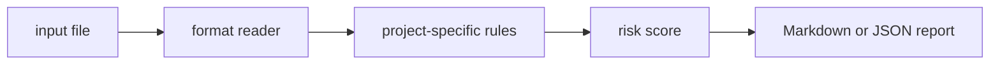

# pii-schema-scout

`pii-schema-scout` is a small local CLI that find privacy-sensitive fields in schemas, exports, and data dictionaries.

## Why it is useful

PII risk often starts in field names and schemas. This CLI flags sensitive columns early so reviews can happen before data ships.

## Key features

- reads text, JSON, JSONL, or CSV inputs
- returns Markdown or JSON reports
- supports severity-based CI exit codes
- keeps all checks deterministic and offline
- includes focused rules for this project:
- `government-id-field`: government identifier field detected
- `contact-pii-field`: direct contact or identity field detected
- `location-field`: location-like field detected

## Installation

```bash
python -m pip install -e ".[dev]"
```

## Usage

```bash
pii-schema-scout examples/sample.txt
pii-schema-scout examples/sample.txt --json
pii-schema-scout path/to/input.txt --fail-on medium --out report.md
python -m pii_schema_scout --help
```

Example input:

```text
customer_email, phone_number, ssn, billing_address
```

## CLI options

```text
pii-schema-scout INPUT [--format auto|text|jsonl|csv|json] [--json]
             [--fail-on low|medium|high] [--out PATH]
```

`INPUT` is any schema text, CSV headers, or data dictionary notes. The tool exits with code `2` when findings meet the selected
threshold, which makes it easy to use in GitHub Actions or release checks.

## Workflow



## Tests

```bash
ruff check .
pytest
python -m pii_schema_scout --help
```

## License

MIT
